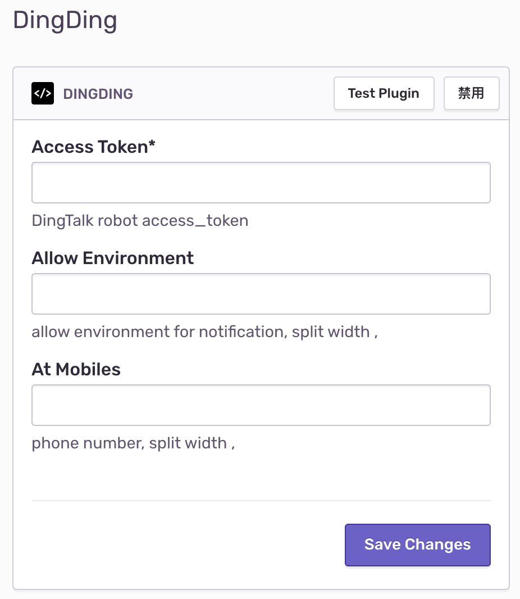
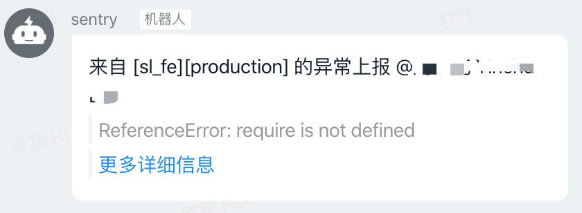

# Sentry-DingDing

`Sentry`的`钉钉`通知插件

## 安装

```bash
$ pip install sentry-dingding
```

## 使用

#### Access Token
在`项目`的所有集成页面找到`DingDing`插件，启用，并设置`Access Token`



#### Access Environments

允许发送钉钉通知的 环境变量，以逗号(',')分隔

#### At Mobiles

需要 @责任人 的钉钉绑定手机号


在插件上使用`Test Plugin`进行测试，当配置好`Access Token`后，在钉钉群内会得到以下警告



点击`href`按钮，打开异常详情页面。
